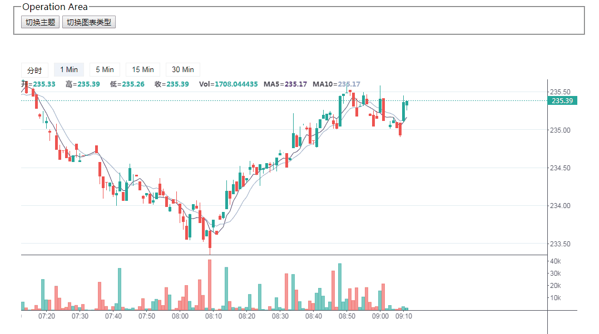

## @vanyi/kline.js

## 安装
`npm i @vanyi/kline`

## 使用
1. 浏览器：`path/to/kline.min.js` 和 `path/to/kline.min.css`  

	 node：`import VyKline from '@vanyi/kline'; import '@vanyi/kline/lib/kline.min.css'`
2. `dom` 内容加载完成后， 启动 `VyKline.bootstrap(options)`； 
3. `options` 配置：
	- `container` 图表挂载点；
	- `deedfeeds` 数据反馈对象 `type: Object`，详细配置见下文；
	- `defaultInterval` 默认时间粒度 `type: String`；
	- `interval` 时间粒度集合 `type: Array`；
	- `theme` 主题  `type: String`, 可选 `light | dark`， 默认：`light`；
	- `customChart` 自定义图表配置 `type: Object`，详细配置见下文；
	- `customLoadingEl` `type: HTMLElement`, 可选 自定义`loading`；
	- `chartType` `type: String`， 可选 `KLINE | EMPTY_KLINE`，默认 `KLINE`；
	- `onTimeIntervalChanged` `type: function`，可选 时间粒度切换时触发该事件，参数为时间粒度。

## 配置
 1. `deedfeeds` 数据反馈对象，为图表输入数据。  
 	#### methods
 	- `setHistoryData({ interval, setHistoryData, subscribeData })` 初始化历史数据 
	
 		>`interval`当前时间粒度  
 		>`setHistoryData` 回调函数，参数为历史数据 `Array`，标准数据对象如下： 
		
 			{
				time: null, // 时间
				open: null, // 开
				high: null, // 高
				low: null, // 低
				close: null, // 收
				volume: null // 交易量
			}	
 		> `getRealTimeData`  回调函数，参数为标准数据对象，同上。
		
 	- `intervalChanged({ interval, setHistoryData, subscribeData })` 时间粒度切换，切换时自动执行，注：此处应该先取消订阅再获取历史数据
	
 	 	>`interval`当前时间粒度  
 		>`setHistoryData` 回调函数，参数为历史数据 `Array`
 		>`subscribeData` 回调函数，参数为当前数据对象 `Object`

2. `defaultInterval` 格式为： `'m1','h1', 'd1', 'w1', 'M1'` 分别对应 `分，时，天，周，月`  
3. `customChart` 图表自定义配置对象：
	
		{
			default_rise_color: '#53b987', // 涨 绿
			default_fall_color: '#eb4d5c', // 跌 红
			init_offset_x: 100, // 初始图表偏移量
			volume_height: 100, // 交易量 canvas 高度
			interval_tool_bar: '30px', // 时间粒度 默认高度
		}  
	
4. `showIntervalToolbar` `boolean` 是否显示时间粒度

## 实例方法
1. `switchChartType` 切换图表类型，type：String 可选值：`KLINE` | `EMPTY_KLINE`
2. `switchTheme` 切换主题，type：String 可选值：`light` | `dark`

## 兼容性
主流浏览器

## License
[MIT](https://opensource.org/licenses/MIT)  
Copyright (c) 2020 Vanyi0924

## 预览地址
[https://vanyi0924.github.io/kline/](https://vanyi0924.github.io/kline/)  

## 示例代码
[Code](./example)  

## 说明
图表完全由数据驱动，只关注数据的传入，所以只要接入符合标准的数据即可。[实例](./example)中为`websocket`方式，
感谢[火币网](https://www.huobi.br.com/zh-cn/)提供的数据接口。

## 关于
这是一个凭借个人兴趣、爱好和责任心在开发维护的项目，如果能给你带来一丝帮助，欢迎star。社区的支持是我前进的动力，爱你萌（づ￣3￣）づ╭❤～！

## 开发中  
- [ ] x，y轴刻度优化
- [ ] 国际化
- [ ] 自定义主题（如果急需自定义可到`/src/config/theme`中修改或新增）
